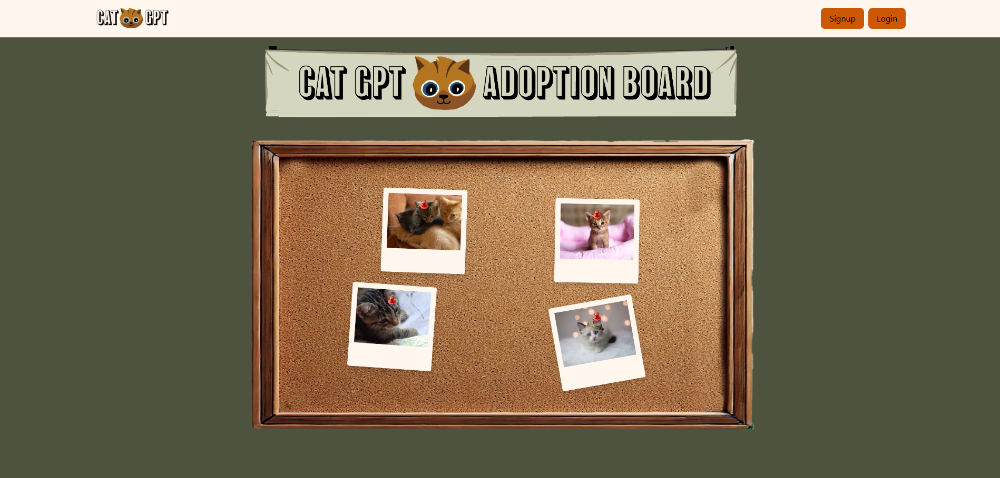
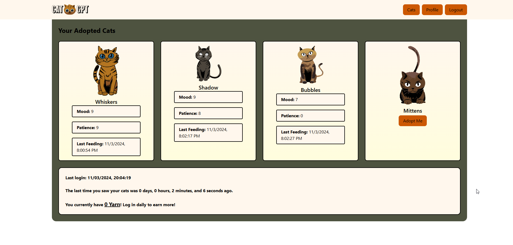
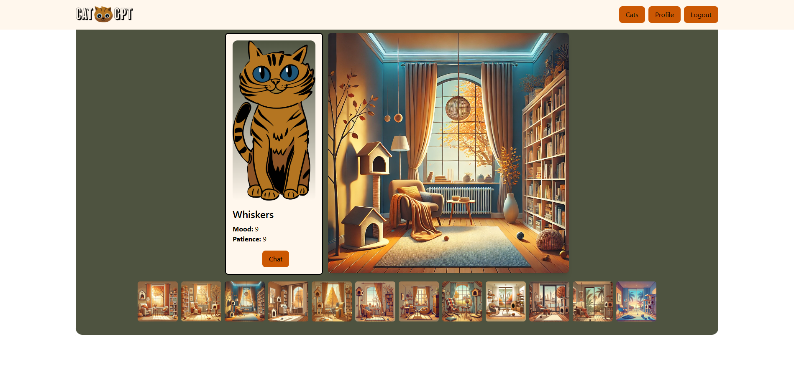
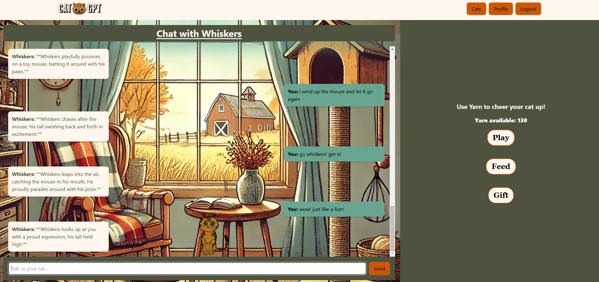
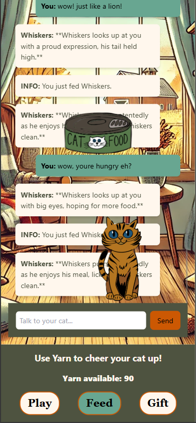

# **Tomogatch.AI** 🐾


  


🌐 **[Live Demo](https://tomogatch-ai.onrender.com/)**

---

# Table of Contents

- [**Tomogatch.AI** 🐾](#tomogatchai-)
- [Table of Contents](#table-of-contents)
  - [**Project Description**](#project-description)
  - [**Screenshots**](#screenshots)
  - [**Features**](#features)
  - [**Technologies Used**](#technologies-used)
  - [**Setup and Installation**](#setup-and-installation)
  - [**Usage**](#usage)
  - [**Project Structure**](#project-structure)
  - [**Contributors**](#contributors)
  - [**License**](#license)
  - [**Acknowledgments**](#acknowledgments)
  - [**Future Enhancements**](#future-enhancements)

---

## **Project Description**

**Tomogatch.AI** is an engaging and interactive virtual pet application developed using **React** for the client-side interface and **Node.js** + **Express** for the server. This unique platform allows users to build relationships with their AI-powered pets through real-time chat interactions, powered by **GPT-based AI**.

The virtual pet evolves over time based on user interactions, offering a personalized and dynamic user experience. User activities are stored in a **document database**, which compiles interaction summaries to provide context for the **OpenAI API**, enriching the conversation with relevant background information.

When users create an account, they receive an initial allotment of virtual currency (yarn). Yarn can be spent on activities to feed and play with their AI pets, adding a gamified element to the experience. The **SQL database** tracks users’ yarn balance, manages bonuses for returning users, and logs expenditures via the server's API endpoints, enhancing engagement and continuity when users visit different parts of the app.

This project is designed with scalability and user feedback in mind, allowing for continuous evolution and feature expansion.

---

## **Screenshots**

- **Landing Page**:
  

- **Home Page**:
  

- **Cat Profile Page**:
  

- **Chat with Whiskers**:
  

- **Chat with Whiskers - Mobile**:
  

---

## **Features**

- **Real-time chat interactions** with a virtual pet.
- **Context-aware responses** leveraging AI-backed logic.
- **Persistent memory** using SQL for long-term engagement.
- **Client-side chat management** with periodic memory synchronization.
- **Interactive UI** built with React for a seamless user experience.
- **Full-stack deployment** on Render for easy accessibility.

---

## **Technologies Used**

- **Backend**: Node.js, Express.js
- **Frontend**: React, TypeScript
- **Database**: SQL-based storage (e.g., PostgreSQL)
- **AI Integration**: OpenAI GPT model
- **Deployment**: Render
- **Version Control**: GitHub

---

## **Setup and Installation**

Follow these steps to get the application running on your local machine:

1. **Clone the Repository**

   ```bash
   git clone <your-repository-url>
   cd Tomogatch.ai
   ```

2. **Install Dependencies**

   ```bash
   npm install
   ```

3. **Set up Environment Variables**  
   Create a `.env` file in the root directory and add the necessary environment variables:

   ```
   OPENAI_API_KEY=<your-openai-api-key>
   DATABASE_URL=<your-database-url>
   ```

4. **Run the Application**

   ```bash
   npm run start
   ```

5. **Access the App**  
   Open your browser and navigate to `http://localhost:3001`.

---

## **Usage**

1. **Adopt a Virtual Pet**: Choose your cat and give it a name.
2. **Chat with Your Pet**: Interact through real-time chat to build a relationship with your pet.
3. **Experience Pet Growth**: See your pet evolve based on how you treat it.
4. **Long-Term Memory Updates**: Enjoy contextual interactions that reflect past interactions.

---

## **Project Structure**

```
Tomogatch.ai/
├── client/                 # React frontend
├── server/                 # Express backend
│   ├── controllers/        # API request handlers
|   |-- templates/          # Prompt Templating
|   |-- middleware/         # JWT Authentication
|   |-- seeds/              # Seed data for testing db
│   ├── models/             # SQL database models
│   ├── routes/             # API endpoints
│   └── templates/          # Custom prompt templates for GPT
├── .env                    # Environment variables
├── package.json            # Project dependencies
└── README.md               # Project documentation
```

---

## **Contributors**

This project is a collaborative effort by the following contributors:

<table>
  <tr>
    <td align="center">
      <a href="https://github.com/DarioJZB">
        
        <br />
        <sub><b>Dario</b></sub>
      </a>
      <br />
      <a href="mailto:dariojab87@gmail.com">dariojzb87@gmail.com</a>
    </td>
    <td align="center">
      <a href="https://github.com/souad-hb">
        
        <br />
        <sub><b>Souad</b></sub>
      </a>
      <br />
      <a href="mailto:souadsalahh@gmail.com">souadsalahh@gmail.com</a>
    </td>
    <td align="center">
      <a href="https://github.com/OccultParrot">
        
        <br />
        <sub><b>Thomas</b></sub>
      </a>
      <br />
      <a href="mailto:stemlertho@gmail.com">stemlertho@gmail.com</a>
    </td>
    <td align="center">
      <a href="https://github.com/savevsgames">
        
        <br />
        <sub><b>Greg</b></sub>
      </a>
      <br />
      <a href="mailto:gregcbarker@gmail.com">gregcbarker@gmail.com</a>
    </td>
  </tr>
</table>

---

## **License**

This project is licensed under the [MIT License](https://opensource.org/licenses/MIT).

---

## **Acknowledgments**

Special thanks to all contributors and the open-source community for their tools and frameworks that made this project possible.

---

## **Future Enhancements**

- **Gamification**: Introduce more interactions like toys, rewards, and challenges.
- **Advanced Memory Management**: Implement smarter AI with enhanced memory capabilities.
- **Push Notifications**: Alert users when the pet needs attention.
- **Mobile App**: Expand the application to mobile platforms.
